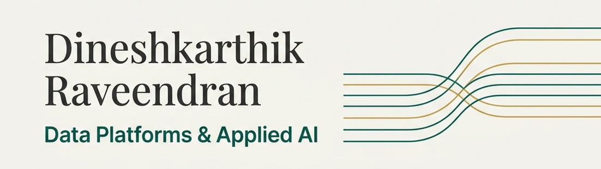

  

# Dineshkarthik Raveendran (DK)

I build data platforms, applied AI enablement, and the engineering teams behind them. 

My work sits at the intersection of data architecture, platform trust, and business operations. I believe a successful data platform isn’t just about technology; it’s about containing complexity in the right places, establishing trust, and building organizational capability that lasts.

Based in Berlin.

---

### 🧩 What I Focus On

#### Platform Strategy & High-Trust Architecture
I design batch, streaming, and lakehouse systems that balance performance with scalability. I specialize in architectures built on tools like Python, Airflow, Spark, Kafka, ClickHouse, Iceberg, and Presto. But more than the stack, my goal is creating a developer experience where analytics and AI delivery are fast, governed, and reliable.

#### Operationalizing AI
I help translate AI opportunities into production systems connected to actual operational workflows. This means focusing on the underlying data foundations and governance needed for measurable adoption and real-world impact.

#### Team Execution
I lead cross-functional engineering teams, guiding analysts, developers, and ML practitioners. I focus on creating a sustainable delivery rhythm, clear prioritization, and high standards of execution.

---

### 🏆 Beyond the Day Job

- **Community & Python**: I'm a contributing member of the [Python Software Foundation (PSF)](https://wiki.python.org/psf/dineshkarthik), supporting the ecosystem behind modern data tooling.
- **Open Source**: I contribute to public-interest technical infrastructure as a tools administrator and developer for [Wikimedia](https://phabricator.wikimedia.org/p/Dineshkarthik/). I also maintain **[telegram-media-downloader](https://github.com/Dineshkarthik/telegram_media_downloader)**, a popular CLI media tool.
- **Writing**: I wrote [*Mastering Time Management: Data-Driven Approaches*](https://amzn.eu/d/g1nYJlo), connecting data-driven thinking with professional operating discipline. I also write regularly about data stack complexity and team leverage on my blog.
- **Speaking**: I share real-world engineering lessons, such as transitioning warehouse-centric architectures to lakehouse patterns (see my talk [*From DWH to Data Lake: A Story of 2 Data Engineers*](https://youtu.be/mUPSAr2dJ3Q?feature=shared&t=947)).

---

### 🛠️ Featured Open Source

* **[telegram-media-downloader](https://github.com/Dineshkarthik/telegram_media_downloader)** — A highly performant, customizable CLI tool to download media files from Telegram channels and chats, supporting advanced filtering and configuration.

  
<b>⭐ Recent Stargazers</b>

  <table cellspacing="0" cellpadding="0" style="border: none;">
    <tbody cellspacing="0" cellpadding="0" style="border: none;">
      <tr style="border: none;">
        <td style="border: none">
          
        </td>
        <td style="border: none">
          

            <a href="https://github.com/ftpwan">ftpwan</a> 
            starred <a href="https://github.com/Dineshkarthik/telegram_media_downloader">telegram_media_downloader</a>
          

          

            User Bio: Nothing to 👀 here , no bio...!!
          

        </td>
      </tr>
      <tr style="border: none;">
        <td style="border: none">
          
        </td>
        <td style="border: none">
          

            <a href="https://github.com/kystorm">ky.storm</a> 
            starred <a href="https://github.com/Dineshkarthik/telegram_media_downloader">telegram_media_downloader</a>
          

          

            User Bio: Nothing to 👀 here , no bio...!!
          

        </td>
      </tr>
      <tr style="border: none;">
        <td style="border: none">
          
        </td>
        <td style="border: none">
          

            <a href="https://github.com/MauricioTdM">Maurício Tavares de Melo</a> 
            starred <a href="https://github.com/Dineshkarthik/telegram_media_downloader">telegram_media_downloader</a>
          

          

            User Bio: Desenvolvedor Frontend focado na construção de aplicações web modernas e responsivas com React, Next.js, TypeScript e Tailwind CSS.
          

        </td>
      </tr>
      <tr style="border: none;">
        <td style="border: none">
          
        </td>
        <td style="border: none">
          

            <a href="https://github.com/msxiehui">MsChong</a> 
            starred <a href="https://github.com/Dineshkarthik/telegram_media_downloader">telegram_media_downloader</a>
          

          

            User Bio: Nothing to 👀 here , no bio...!!
          

        </td>
      </tr>
      <tr style="border: none;">
        <td style="border: none">
          
        </td>
        <td style="border: none">
          

            <a href="https://github.com/hadkh777-ship-it">hadkh777-ship-it</a> 
            starred <a href="https://github.com/Dineshkarthik/telegram_media_downloader">telegram_media_downloader</a>
          

          

            User Bio: Nothing to 👀 here , no bio...!!
          

        </td>
      </tr>
      <tr style="border: none;">
        <td style="border: none">
          
        </td>
        <td style="border: none">
          

            <a href="https://github.com/1716285375">Jiezcode</a> 
            starred <a href="https://github.com/Dineshkarthik/telegram_media_downloader">telegram_media_downloader</a>
          

          

            User Bio: Take it easy, Enjoy your life.
          

        </td>
      </tr>
      <tr style="border: none;">
        <td style="border: none">
          
        </td>
        <td style="border: none">
          

            <a href="https://github.com/ZankunLee">ZankunLee</a> 
            starred <a href="https://github.com/Dineshkarthik/telegram_media_downloader">telegram_media_downloader</a>
          

          

            User Bio: Nothing to 👀 here , no bio...!!
          

        </td>
      </tr>
      <tr style="border: none;">
        <td style="border: none">
          
        </td>
        <td style="border: none">
          

            <a href="https://github.com/misaka9582">misaka9582</a> 
            starred <a href="https://github.com/Dineshkarthik/telegram_media_downloader">telegram_media_downloader</a>
          

          

            User Bio: Nothing to 👀 here , no bio...!!
          

        </td>
      </tr>
      <tr style="border: none;">
        <td style="border: none">
          
        </td>
        <td style="border: none">
          

            <a href="https://github.com/miiwu">miiwu</a> 
            starred <a href="https://github.com/Dineshkarthik/telegram_media_downloader">telegram_media_downloader</a>
          

          

            User Bio: Whatever?
Do it.
          

        </td>
      </tr>
      <tr style="border: none;">
        <td style="border: none">
          
        </td>
        <td style="border: none">
          

            <a href="https://github.com/aguerra626">aguerra626</a> 
            starred <a href="https://github.com/Dineshkarthik/telegram_media_downloader">telegram_media_downloader</a>
          

          

            User Bio: Nothing to 👀 here , no bio...!!
          

        </td>
      </tr>
      </tbody>
  </table>

---

### ✍️ Selected Writing

- [What executives actually need from a data leader](https://dineshkarthik.me/blogs/what-executives-actually-need-from-a-data-leader?utm_source=github.com&utm_medium=readme&utm_campaign=GitHub_Profile)
- [Where AI fits in the modern data stack](https://dineshkarthik.me/blogs/where-ai-fits-in-the-modern-data-stack?utm_source=github.com&utm_medium=readme&utm_campaign=GitHub_Profile)
- [How to reduce data platform complexity without slowing teams down](https://dineshkarthik.me/blogs/reduce-data-platform-complexity?utm_source=github.com&utm_medium=readme&utm_campaign=GitHub_Profile)
- [Why most data teams are busy but not effective](https://dineshkarthik.me/blogs/why-most-data-teams-are-busy-but-not-effective?utm_source=github.com&utm_medium=readme&utm_campaign=GitHub_Profile)
- [What I look for in a modern data platform](https://dineshkarthik.me/blogs/what-i-look-for-in-a-modern-data-platform?utm_source=github.com&utm_medium=readme&utm_campaign=GitHub_Profile)

---

### 📊 GitHub Analytics

  
  

---

### Connect with Me 🤝

  
  
  
  
    
  

